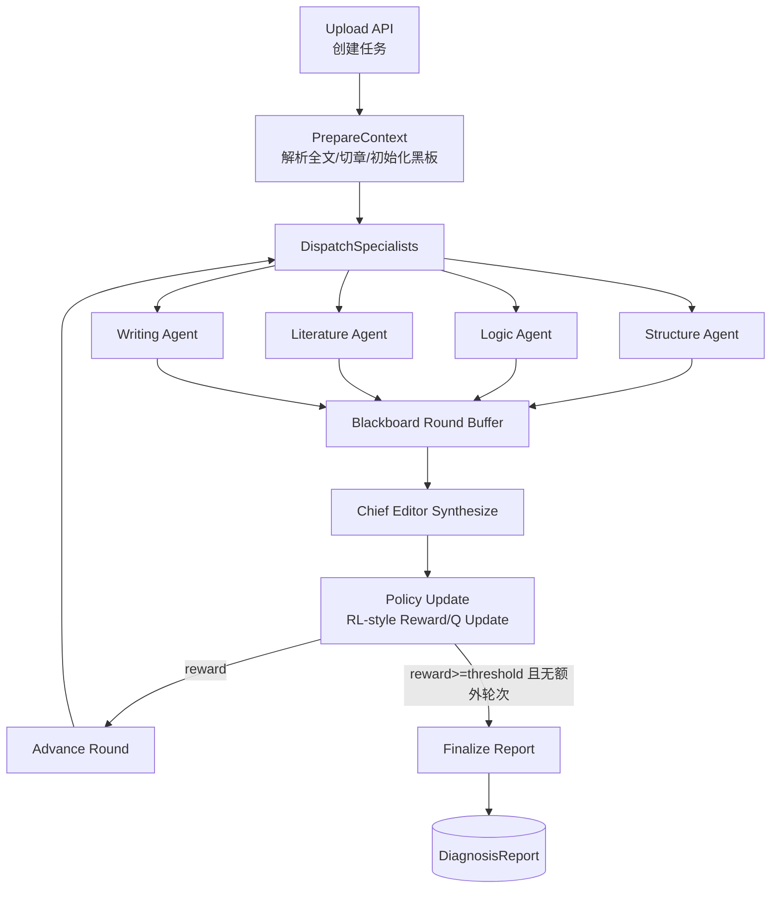
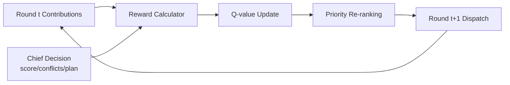

# 多智能体论文改进系统

一个面向论文诊断、结构优化、逻辑审查、文献对照与写作润色的透明化多智能体协同系统。

本项目不仅输出最终建议，还会把任务分发、章节切分、智能体回执、冲突关系和总控汇总过程对用户透明展示，适合用于论文深度修改、教学演示和研究验证。

## 当前版本

- 当前项目版本：`v0.2.1`
- 发布日期：`2026-03-23`
- 版本基准：以 Git tag 为准，前后端 `package.json` 与 release tag 保持一致
- Release Notes：存放于 `docs/releases/`，推送 `v*` tag 后可自动触发 GitHub Release 工作流

## 项目定位

- 面向论文改进，而不是泛化聊天问答
- 强调透明过程，而不是黑箱式“一次性答案”
- 支持章节级问题定位、冲突图谱和最终修订路线
- 提供前后端完整产品化界面，适合作为开源项目继续迭代

## 核心能力

- 多智能体协同审查：结构、逻辑、文献、写作 4 个专家智能体 + 1 个总控编辑
- 多智能体框架编排：支持 `CLASSIC`（原生编排）与 `LANGGRAPH`（状态图编排）双引擎，可按环境变量切换
- 透明化工作流：事件流、Prompt Trace、Agent Findings、Chief Decision
- 章节级洞察：自动切分章节、查看每章命中问题与建议
- 冲突图谱：展示不同智能体在同一章节或同一问题链上的关联与冲突
- 双语国际化（i18n）：前端完整中英文支持，后端活动消息国际化，API 返回双语内容
- 导出能力：支持 Markdown、Word 友好文本、DOCX 报告导出
- 运行时并发控制：可设置真实评审并发数，适配不同模型平台限流策略
- 工作台持续产品化：支持项目删除、项目重新分析、搜索高亮、分页与页大小切换
- 在线系统调优：支持连通性重测、测试历史缓存、模型配置在线编辑与即时保存
- 代理配置持久化：在线修改 API URL/Key/Model 后自动保存到 `.env` 文件

## 系统页面

- `/` 项目总览 / 产品首页
- `/upload` 新建分析任务
- `/project/:id/progress` 透明进度页
- `/project/:id/chapter/:chapterNo` 章节详情页
- `/project/:id/report` 最终诊断报告页
- `/help` 帮助文档中心
- `/system-check` 系统检查与模型配置页

## 技术栈

### 前端
- Vue 3
- Vite
- Tailwind CSS
- Pinia
- Vue Router

### 后端
- Node.js
- Express
- TypeScript
- LangGraph（多智能体状态图编排，可选）
- 原生 Orchestrator（CLASSIC 兼容模式）
- Prisma
- SQLite

### 文档解析
- `pdf-parse`
- `mammoth`

## 目录结构

```text
.
├── backend/                  # 后端服务
│   ├── prisma/               # Prisma schema 与数据库
│   └── src/
│       ├── agents/           # 专家智能体与总控逻辑
│       ├── engine/           # 工作流、黑板、活动追踪
│       ├── lib/              # i18n 活动消息翻译等公共库
│       ├── modules/          # upload / project / system 等路由模块
│       ├── parser/           # PDF / DOCX / chapter splitter
│       └── llm/              # OpenAI 兼容 LLM 调用封装
├── frontend/                 # 前端界面
│   └── src/
│       ├── pages/            # 首页、上传、进度、报告、帮助等页面
│       ├── lib/              # API、i18n 与前端格式化逻辑
│       └── store/            # Pinia 状态管理
├── docs/                     # 示例论文、补充文档
├── start.sh                  # macOS / Linux 一键启动
└── start.bat                 # Windows 一键启动
```

## 快速启动

### 1. 环境要求

- Node.js 18+
- npm 9+

### 2. 配置环境变量

复制模板：

```bash
cp .env.example .env
```

在根目录 `.env` 中填写 OpenAI 兼容模型配置：

```env
PORT=3000
NODE_ENV=development
DATABASE_URL="file:./dev.db"

CHIEF_API_URL=https://your-openai-compatible-endpoint/v1
CHIEF_API_KEY=sk-xxxx
CHIEF_MODEL=qwen3-max

STRUCTURE_API_URL=https://your-openai-compatible-endpoint/v1
STRUCTURE_API_KEY=sk-xxxx
STRUCTURE_MODEL=qwen3-max

LOGIC_API_URL=https://your-openai-compatible-endpoint/v1
LOGIC_API_KEY=sk-xxxx
LOGIC_MODEL=qwen3-max

LITERATURE_API_URL=https://your-openai-compatible-endpoint/v1
LITERATURE_API_KEY=sk-xxxx
LITERATURE_MODEL=qwen3-max

WRITING_API_URL=https://your-openai-compatible-endpoint/v1
WRITING_API_KEY=sk-xxxx
WRITING_MODEL=qwen3-max
```

可选：

```env
REVIEW_MAX_CONCURRENCY=1
WORKFLOW_ENGINE=LANGGRAPH
RL_MAX_ROUNDS=3
RL_EXPLORATION_RATE=0.2
RL_LEARNING_RATE=0.35
RL_REWARD_THRESHOLD=0.6
```

说明：
- 推荐默认 `1`，更适合限流友好模式
- 如果你的模型平台额度充足，可以尝试调到 `2-4`
- `WORKFLOW_ENGINE` 可选 `CLASSIC` 或 `LANGGRAPH`
- 当使用 `LANGGRAPH` 时，系统会启用“带环路 + RL 风格策略更新”的自适应多轮评审

## LangGraph 自适应多智能体关系图

当 `WORKFLOW_ENGINE=LANGGRAPH` 时，系统采用“状态图 + 反馈环”编排：



### RL 风格策略环（复杂模式）

系统并不做离线训练，而是在单次任务内进行在线策略更新（近似 contextual bandit）：



奖励信号示意（归一化）：

$$
r_t = \text{score}_{norm} - \lambda_1\cdot\text{conflicts} - \lambda_2\cdot\text{majorIssues} + \lambda_3\cdot\text{planDensity}
$$

每个专家优先值更新：

$$
Q_{a}^{t+1} = Q_{a}^{t} + \alpha\left(r_t - Q_{a}^{t}\right)
$$

并通过 $\epsilon$-greedy 在每轮做少量探索，避免固定排序导致的审查盲区。

### 3. 安装依赖

前端：

```bash
cd frontend
npm install
```

后端：

```bash
cd backend
npm install
```

### 4. 初始化数据库

```bash
cd backend
npx prisma db push
npx prisma generate
```

### 5. 一键启动项目

macOS / Linux：

```bash
chmod +x start.sh
./start.sh
```

Windows：

```bat
start.bat
```

### 6. 关闭项目

macOS / Linux：

- 在运行 `./start.sh` 的终端窗口按 `Ctrl+C`

- 如果前端或后端是单独在后台启动的，也可以手动结束进程：

```bash
pkill -f "tsx src/app.ts"
pkill -f "vite"
```

Windows：

- 在运行 `start.bat` 的命令行窗口按 `Ctrl+C`

### 7. 重启项目

macOS / Linux：

- 如果你是通过一键脚本启动，先按 `Ctrl+C` 停止，再执行：

```bash
./start.sh
```

- 如果你是分别启动前后端，也可以只重启其中一端

Windows：

- 关闭后再次执行：

```bat
start.bat
```

### 8. 单独启动前端或后端

适合开发调试时只重启其中一端。

单独启动后端：

```bash
cd backend
npx tsx src/app.ts
```

单独启动前端：

```bash
cd frontend
npm run dev
```

单独关闭进程：

- 如果是在当前终端前台运行，直接按 `Ctrl+C`
- 如果是后台运行，可执行：

```bash
pkill -f "tsx src/app.ts"
pkill -f "vite"
```

### 9. 访问地址

- 前端：`http://localhost:5173`
- 后端：`http://localhost:3000`
- 系统检查页：`http://localhost:5173/system-check`

## 使用方式

### 正常使用路径

1. 打开首页，查看项目总览或产品介绍
2. 进入系统检查页，确认 API Key、模型地址和并发设置正常
3. 如需修改模型配置，可直接在系统检查页在线编辑 API 地址、模型和密钥并保存
4. 在上传页选择论文，并设置评审并发数
5. 进入透明进度页，查看解析状态、章节切分、日志和冲突图谱
6. 必要时进入章节详情页逐章查看问题
7. 若需复跑，可在首页项目工作台对单个项目发起重新分析
8. 完成后进入诊断报告页导出报告

### 一键 Demo

首页和帮助中心提供 Demo 入口，可直接生成一份可浏览的示例项目。

## 系统检查与调优

系统检查页可查看：

- 当前环境
- 数据库是否已配置
- 每个智能体的 API URL、模型、密钥是否加载
- 当前评审并发数

你也可以直接在系统检查页：

- 修改评审并发数，适配不同平台的限流策略
- 手动发起连通性测试并查看详细结果（含状态码、耗时、错误摘要）
- 查看最近测试历史缓存
- 在线修改每个智能体的 API URL、模型和密钥（自动保存到 `.env`）

### API 接口说明

系统检查相关 API：

- `GET /api/system/diagnostics` - 获取系统诊断信息
- `POST /api/system/diagnostics/connectivity` - 手动触发连通性测试
- `POST /api/system/diagnostics/agents/:agentName` - 更新指定智能体配置
- `POST /api/system/settings/review-concurrency` - 修改评审并发数

项目管理相关 API：

- `GET /api/projects` - 获取项目列表
- `POST /api/projects` - 创建新项目
- `DELETE /api/projects/:projectId` - 删除项目（级联清理）
- `POST /api/projects/:projectId/re-run` - 重新分析项目

## 工作台增强

首页项目工作台当前支持：

- 搜索项目并高亮命中词
- 分页浏览与页大小切换
- 删除项目
- 对单个项目重新发起论文分析

## 常见问题

### 重新分析后变成 `Full Document (Unstructured)`

原因：

- 旧版本重新分析时会把已切分章节的正文重新拼接，而不是使用首次上传时的原始解析文本
- 由于拼接结果丢失了章节标题，系统再次切分时可能无法识别章节结构，最终退化为整篇未结构化文档

现在的修复方式：

- 新上传项目会在数据库中保存首次解析得到的原始文本，并在重新分析时优先使用它
- 历史老项目如果还没有原始文本，系统会自动用“章节标题 + 章节正文”重建近似原文，再尝试重新切分

如果你已经拉取了最新代码，请执行一次数据库同步并重启后端：

```bash
cd backend
npx prisma db push
npx prisma generate
```

然后重新启动项目，再点击首页工作台中的“重新分析”。

### 前端页面打不开

- 确认前端开发服务器是否运行在 `http://localhost:5173`
- 如果端口被占用，先结束旧的 `vite` 进程再重新启动

### 后端接口 3000 无响应

- 确认后端服务是否运行在 `http://localhost:3000`
- 可访问 `http://localhost:3000/api/health` 检查健康状态
- 如果端口被占用，先结束旧的 `tsx src/app.ts` 进程再重新启动

## 导出能力

报告页当前支持导出：

- Markdown
- Word 友好文本（TXT）
- DOCX

适合做项目留档、论文指导记录、课程展示和修改报告归档。

## 开源与许可说明

本项目是开源项目，但**不可商用**。

你可以：
- 学习、研究、教学演示
- 个人非商业修改与二次开发
- 在非商业场景中引用或展示本项目

你不可以：
- 将本项目整体或改造后版本用于商业销售
- 作为收费 SaaS、闭源咨询产品、商业服务的一部分直接分发
- 移除原许可并进行未经授权的商业包装

详细条款请查看：

- `LICENSE`
- `NOTICE`

## 维护建议

- 如果模型平台频繁限流，优先把并发数设置为 `1`
- 如果输出中仍存在较多英文，可以继续增强术语白名单与字段级中文化规则
- 如果需要更稳定的大文件解析，建议后续引入更强的 PDF 结构化解析器
- 前端 i18n 翻译文件位于 `frontend/src/lib/i18n.ts`，可扩展其他语言
- 后端 i18n 活动消息文件位于 `backend/src/lib/activity-i18n.ts`

## 已知边界

- PDF 提取质量受源文件质量影响
- 开创性英文论文在审查结果中可能保留极少数算法名和论文标题原文
- 极端限流情况下，即使有重试和限流友好模式，也可能出现上游失败

## 贡献

欢迎通过 Issue / PR 的方式继续完善：

- 可访问性与对比度优化
- 更强的章节定位
- 更稳定的字段级中文化
- 更丰富的导出格式
- 多轮审查策略与更智能的冲突协调
- 国际化扩展（更多语言支持）

## 维护者联系方式

- Maintainer: Haibo Team
- Email: 3218541421@qq.com
- GitHub Issues: `https://github.com/Dajucoder/Multi-Agent-Paper-Improvement-System/issues`

## 发布流程

1. 更新 `CHANGELOG.md`
2. 同步前后端版本号与目标 tag
3. 在 `docs/releases/` 新建对应版本的 release notes
4. 提交 release commit，并创建形如 `v0.2.1` 的 tag
5. 推送分支与 tag 后，GitHub Actions 会自动创建 Release
